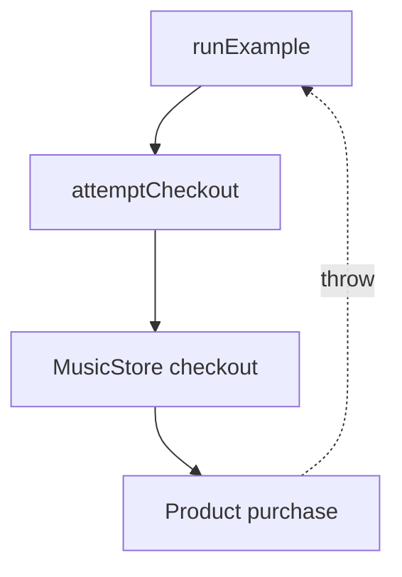

# Exception Handling — Music Store

This Unit 9 project extends the music-store application with exceptional
purchase conditions. It demonstrates how an error is detected where it occurs
and handled at the application level.

## Main learning goals

Students will learn to:

- distinguish the normal return path from an exceptional path;
- throw `std::invalid_argument` and `std::out_of_range`;
- define and throw a custom exception derived from `std::runtime_error`;
- catch exceptions by const reference;
- order specific catch blocks before a general `std::exception` handler;
- use `what()` and custom exception getters;
- explain propagation through functions that do not catch an exception;
- observe destructor execution during stack unwinding;
- preserve valid object state when an operation fails.

## Exception flow



`Product::purchase` validates quantity and stock. `MusicStore::checkout` may
also reject an unknown product code. Neither `checkout` nor `attemptCheckout`
catches these errors, so they propagate to the handlers in `runExample`.

## Exceptions used

| Situation | Exception |
|---|---|
| Non-positive purchase quantity | `std::invalid_argument` |
| Duplicate product code | `std::invalid_argument` |
| Unknown product code | `std::out_of_range` |
| Requested quantity exceeds stock | `InsufficientStockError` |

## Build and run

From the repository root:

```bash
cd Exception_Handling_Music_Store
make run
make test
```

The demonstration performs one successful purchase and three failing
purchases. The `ScopeTracer` messages make stack unwinding visible.

## Recommended reading order

1. `Product.hpp` and `Product.cpp` — locate every `throw` statement.
2. `InsufficientStockError.hpp` — inspect inheritance and stored error data.
3. `MusicStore.cpp` — identify which exceptions propagate unchanged.
4. `main.cpp` — inspect try blocks, handler order, and stack unwinding.
5. `tests/test_exceptions.cpp` — verify each success and failure path.
6. `EXERCISES.md` — complete the guided extensions.

## Important design decision

`Product::purchase` checks all failure conditions before reducing stock.
Consequently, a failed purchase leaves the Product unchanged. This is a basic
exception-safety guarantee and a practical reason to validate before modifying
object state.

The project catches exceptions by `const` reference to avoid copying and to
preserve polymorphic behavior. Destructors do not throw exceptions.

## Project structure

```text
Exception_Handling_Music_Store/
├── include/
│   ├── InsufficientStockError.hpp
│   ├── Product.hpp
│   └── MusicStore.hpp
├── src/
├── tests/
│   └── test_exceptions.cpp
├── EXERCISES.md
├── Makefile
└── README.md
```
