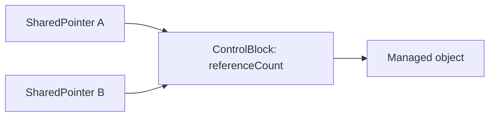

# Musicians and Instruments — Smart Pointer Implementation

This C++17 learning project implements two compact smart-pointer templates and
uses them in a musical application. `UniquePointer<T>` represents exclusive
ownership, while `SharedPointer<T>` implements shared ownership through a
control block and reference counter.

The project is inspired by the lifecycle-focused musician example in the
[Ariel University smart-pointer materials](https://github.com/cpp-at-ariel/cpp-5786/tree/main/11-smart-pointers)
and develops original smart-pointer implementations, class design,
demonstration, tests, and exercises.

## Learning objectives

After completing the project, learners should be able to:

- explain how `UniquePointer<T>` stores and deletes a raw pointer;
- implement deleted copy operations and move operations;
- transfer a `UniquePointer` using `std::move`;
- explain why the source pointer becomes empty after ownership transfer;
- return exclusive ownership from a function;
- explain the role of a shared control block;
- implement shared copy construction and copy assignment;
- explain how copying a `SharedPointer` changes its reference counter;
- predict when musicians and instruments are destroyed;
- use `operator*`, `operator->`, `get`, `reset`, and `useCount`;
- compare the learning implementations with the standard smart pointers.

## Smart-pointer implementations

### `UniquePointer<T>`

`UniquePointer<T>` stores one raw pointer. Its destructor deletes the managed
object. Copy construction and copy assignment are deleted, while move
construction and move assignment transfer the address and clear the source.

It also provides `get`, `operator*`, `operator->`, `operator bool`, `release`,
`reset`, and `swap`.

### `SharedPointer<T>`

`SharedPointer<T>` points to a dynamically allocated control block:



Copying a `SharedPointer` increments `referenceCount`. Destruction and reset
decrement it. The final owner deletes both the managed object and the control
block. Move operations transfer a place among the owners without increasing
the count.

## Project story

Each `Musician` contains `UniquePointer<Instrument>`. The instrument has one
owner and can be transferred from one musician to another.
`releaseInstrument` returns ownership to the caller, and `receiveInstrument`
transfers it into a new musician.

Each `Ensemble` stores `SharedPointer<Musician>`. A guest musician can
participate in two ensembles at the same time. Both pointers refer to the same
musician, and that musician remains alive while either ensemble remains an
owner.

## Quick start

```bash
git clone https://github.com/ARGELIBEN77/OOP_IN_ARG26.git
cd OOP_IN_ARG26/Musicians_and_Instruments_Smart_Pointers
make run
```

Run the tests:

```bash
make test
```

Remove generated executables:

```bash
make clean
```

## What to observe

The first part transfers one guitar through three owners:

1. a local `UniquePointer`;
2. the first musician;
3. the second musician.

At each transfer, the source pointer becomes empty while the same instrument
remains alive.

The second part creates one guest musician and copies the same `SharedPointer`
in two ensembles. The demonstration releases the original pointer and shows
that both ensembles can still access the musician and instrument.

## Recommended learning sequence

1. Read `UniquePointer.hpp` and trace its destructor and move constructor.
2. Run Part 1 and draw the owner after every `std::move`.
3. Read the `SharedPointer` control block and copy constructor.
4. Run Part 2 and trace the shared guest's owner count.
5. Trace copy assignment, move assignment, `reset`, and final deletion.
6. Verify that both ensembles refer to the same `Musician` object.
7. Read the tests and complete `EXERCISES.md`.

## Project structure

```text
Musicians_and_Instruments_Smart_Pointers/
├── include/
│   ├── Ensemble.hpp       Shared musician ownership
│   ├── Instrument.hpp     Exclusively owned resource
│   ├── Musician.hpp       UniquePointer instrument owner
│   ├── SharedPointer.hpp  Reference-counted pointer implementation
│   └── UniquePointer.hpp  Move-only pointer implementation
├── src/
│   ├── Ensemble.cpp
│   ├── Instrument.cpp
│   ├── Musician.cpp
│   └── main.cpp           Ownership and lifetime demonstration
├── tests/
│   └── test_musicians.cpp
├── EXERCISES.md
├── Makefile
└── README.md
```

## Ownership map

| Relationship | C++ representation | Meaning |
|---|---|---|
| Musician to instrument | `UniquePointer<Instrument>` | One musician owns the instrument |
| Ensemble to guest musician | `SharedPointer<Musician>` | Several ensembles keep one musician alive |
| Temporary access | `const Musician&` | Read an existing musician without becoming an owner |

`Musician::getLivingObjectCount()` and
`Instrument::getLivingObjectCount()` make automatic destruction observable in
the demonstration and tests.
