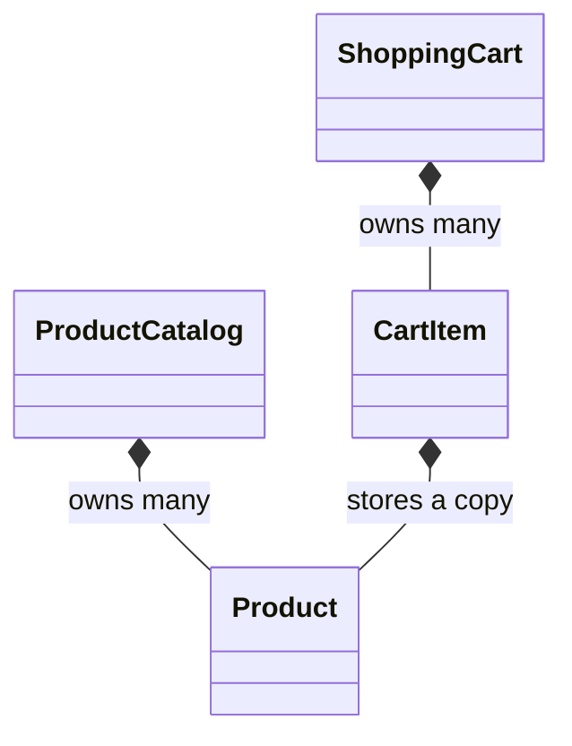

# Product Catalog and Shopping Cart

This project adds a store section to the Music Library application. It focuses
on relationships between ordinary classes before inheritance is introduced.

## Main learning goals

Students will learn to:

- design several classes with separate responsibilities;
- protect state through encapsulation and controlled modification;
- use constructors and initializer lists;
- pass objects by const reference;
- return pointers for optional search results and check for `nullptr`;
- model composition with objects stored by value;
- use `std::vector` to store objects;
- make objects collaborate through small public interfaces;
- calculate item subtotals, total quantity, and total price.

## Object relationships



- `ProductCatalog` owns its catalog products.
- `ShoppingCart` owns its cart items.
- Each `CartItem` owns a Product copy representing the selected product.
- `findByCode` temporarily returns a non-owning pointer to a catalog Product.

## Build and run

From the repository root:

```bash
cd Product_Catalog_and_Shopping_Cart
make run
make test
```

## Recommended reading order

1. `Product.hpp` and `Product.cpp` — review one encapsulated class.
2. `CartItem.hpp` and `CartItem.cpp` — identify the contained Product.
3. `ProductCatalog.hpp` and `ProductCatalog.cpp` — trace search and duplicates.
4. `ShoppingCart.hpp` and `ShoppingCart.cpp` — trace collaboration and totals.
5. `main.cpp` — follow Product selection from catalog to cart.
6. `tests/test_store.cpp` — inspect the expected relationships and behavior.
7. `EXERCISES.md` — complete the guided extensions.

## Important design decisions

The cart stores Product copies. Therefore, changing a catalog Product after it
has been added does not retroactively change the price recorded in that cart.
This is a deliberate snapshot model and a useful composition example.

The pointer returned by `findByCode` is non-owning. Client code must not delete
it. It should also be used before adding more products to the catalog, because
growing the catalog vector may invalidate pointers to its elements.

The central learning question is how several ordinary classes collaborate:
which object owns each value, which object performs each operation, and what
information crosses each class interface.

## Project structure

```text
Product_Catalog_and_Shopping_Cart/
├── include/
│   ├── Product.hpp
│   ├── ProductCatalog.hpp
│   ├── CartItem.hpp
│   └── ShoppingCart.hpp
├── src/
├── tests/
│   └── test_store.cpp
├── EXERCISES.md
├── Makefile
└── README.md
```
